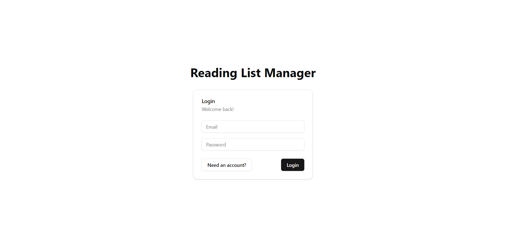
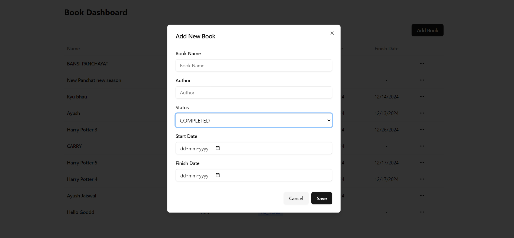
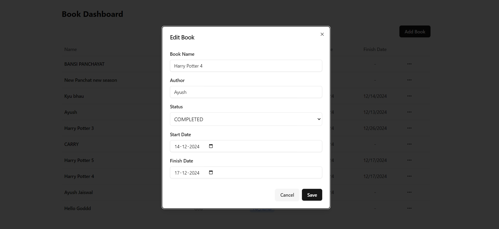
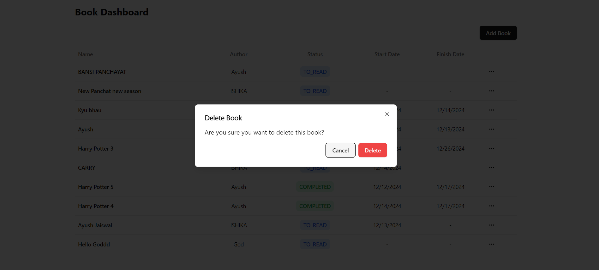

# Reading List Manager

Reading  List Manger project is a full stack project where user can sign in and manage their reading list.

## Table of Contents

- [Project Features](#project-features)
- [Tech Stack](#tech-stack)
- [Backend Libraries Used](#backend-libraries-used)
- [Setup and Installation](#setup-and-installation)
- [Environment Variables](#environment-variables)
- [Development Choices](#development-choices)
- [Deployment](#deployment)

---

## Project Features

- **Authentication**: Implement secure user authentication using JWT
- **Access Control**: Protected routes for authenticated users
- **Rate Limiting**: Prevent misuse by limiting request to API endpoint.

---

## Tech Stack

- **Backend**: NodeJs, Express, Typescript
- **Database**: Postgres, Redis
- **Frontend**: React, Typescript

---

## Backend Libraries Used

- **dotenv**: Loads environment variables from `.env` file.
- **express**: Fast, minimal web server framework.
- **nodemon**: Automatically restarts server on file changes..
- **typescript**: Used to write TypeScript code.
- **ts-node**: Execute typescript code.
- **jsonwebtoken**: Implement authentication and role based access control
- **redis**: Implement rate limiter mechanism.

---

## Setup and Installation

### Prerequisites

- NodeJS
- Postgres
- Redis

### Environment Variables

- Create a `.env` file in the backend directory and copy the content from `.env.example` into it.
- Get Postgres and Redis Dtabase url

### Steps

1. **Clone the Repository**:
   ```bash
   git clone https://github.com/ayushjaiz/Reading-List-Manager
   cd Reading-List-Manager
   ```
3. **Run the Backend Application:**
   ```bash
   npm install
   npm run build
   npm run start
   ```
4. **Run the Frontend Application:**
   ```bash
   npm install
   npm run build
   npm run start
   ```

---


## Development Choices

### Why Node.js?

- Excellent package ecosystem
- Strong async/await support
- Easy deployment options

### Why Typescript?

- Prevent from errors during development phase
- Type security
- Faster code development

### Why Redis?

- In memory database
- Faster operations

### Why React

- Virtual DOM Support
- Components can be reused

---

## Acknowledgements

This project was completed with the assistance of various online resources. I utilized the following tools and sources to support the development of this application:

- Google + Stack Overflow - for bugs and documentation of libraries
- Redis docs
- Some youtube tutorials understanding rate limiter

## Images

Login page


Dashboard


Add book


Edit book


Delete book
